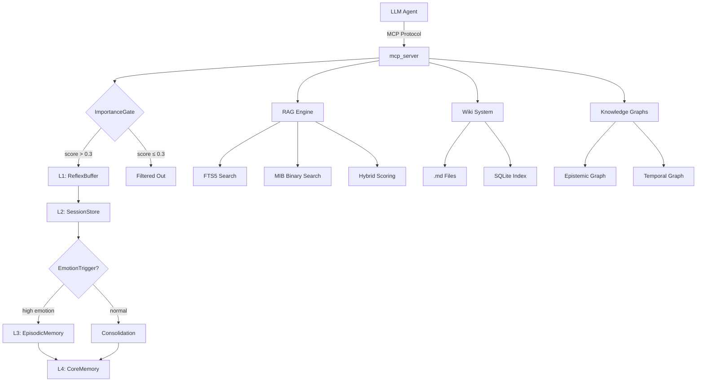

# mcp-ariel-memory

> **Give your AI agents real memory** — episodic recall, knowledge graphs, hybrid search, and envelope encryption in a single MCP server. 19 tools. 4-layer hierarchy. 250+ tests.

[](https://github.com/Cipher208/mcp-ariel-memory/actions/workflows/ci.yml)
[](https://codecov.io/gh/Cipher208/mcp-ariel-memory)
[](https://opensource.org/licenses/MIT)
[](https://www.python.org/downloads/)
[](https://github.com/astral-sh/ruff)
[](https://modelcontextprotocol.io/)
[](https://cipher208.github.io/mcp-ariel-memory/)
[](https://github.com/Cipher208/mcp-ariel-memory/releases)

---

## About

mcp-ariel-memory is a production-ready MCP (Model Context Protocol) server that provides persistent, searchable memory for AI agents. It implements a two-layer architecture:

- **Layer 1 (User)** — stores facts about users: preferences, conversation history, emotional context, relationships
- **Layer 2 (Agent)** — stores agent identity: decisions, errors, personality evolution, learning patterns

The server is built with the official MCP Python SDK (FastMCP), supports both stdio and HTTP transports, and includes enterprise features like authentication, rate limiting, automatic backups, and a real-time dashboard.

### Architecture



### Why mcp-ariel-memory?

| Feature | mcp-ariel-memory | Typical Memory |
|---------|------------------|----------------|
| **Memory hierarchy** | L1→L2→L3→L4 (4 layers) | Flat key-value store |
| **Hybrid search** | FTS5 + binary embeddings + RRF | FTS or vector only |
| **ITS scoring** | Novelty + relevance via document frequency | None |
| **Knowledge graphs** | Epistemic + Temporal | None |
| **Typed memory** | 13 categories with per-type retention | None |
| **Two layers** | User (about people) + Agent (self-knowledge) | User only |
| **Wiki** | 14 types, .md files as source of truth, FTS5 | None |
| **24 hooks** | Intercept operations at every stage | 0 |
| **Encryption** | libsodium secretbox (keychain-first) | Usually none |
| **Tests** | 250 (79 property-based/logic/chaos) | — |
| **Dashboard** | Real-time HTML dashboard | — |

### Who needs this?

- **AI agent developers** — give your agent memory that persists across sessions
- **Multi-agent systems** — one database, isolated tables, shared memory on demand
- **Anyone tired of "forget context every request"** — mcp-ariel-memory remembers for you
- **Data-conscious teams** — everything local, no cloud dependency

## Installation

### Option 1: npm (recommended for MCP clients)

```bash
npx mcp-ariel-memory --transport stdio
```

Requires Python 3.10+ on the system. The npm wrapper automatically installs the Python package.

### Option 2: pip

```bash
pip install git+https://github.com/Cipher208/mcp-ariel-memory.git
python -m mcp_server --transport stdio
```

### Option 3: Docker

```bash
docker build -t ariel-memory .
docker run -p 8000:8000 ariel-memory
```

### Option 4: From source

```bash
git clone https://github.com/Cipher208/mcp-ariel-memory.git
cd mcp-ariel-memory
pip install -e ".[all]"
python -m mcp_server.server --transport stdio
```

---

## Quick Start

### Claude Desktop

Add to `claude_desktop_config.json`:

```json
{
  "mcpServers": {
    "ariel-memory": {
      "command": "npx",
      "args": ["mcp-ariel-memory", "--transport", "stdio"]
    }
  }
}
```

Or with Docker:

```json
{
  "mcpServers": {
    "ariel-memory": {
      "command": "docker",
      "args": ["run", "--rm", "-i", "ariel-memory", "--transport", "stdio"]
    }
  }
}
```

### Hermes Agent

Add to Hermes config (YAML format):

```yaml
mcpServers:
  ariel-memory:
    command: npx
    args:
      - mcp-ariel-memory
      - --transport
      - stdio
```

### HTTP Server

```bash
# Start HTTP server (no auth required for MCP endpoint)
python -m mcp_server.server --transport http --port 8000

# With dashboard (disabled by default)
python -m mcp_server.server --transport http --port 8000 --dashboard

# Development mode (no auth at all)
python -m mcp_server.server --transport http --port 8000 --no-auth

# Or with Docker
docker run -p 8000:8000 ariel-memory --transport http --port 8000
```

### docker-compose

```bash
docker-compose up
```

---

## Platform Support

| Platform | Method | Notes |
|----------|--------|-------|
| **Windows** | npm / pip / Docker | aiosqlite fallback (sync sqlite3 + to_thread) |
| **Linux** | npm / pip / Docker | aiosqlite (native async) |
| **macOS** | npm / pip / Docker | aiosqlite (native async) |
| **Docker** | Any | Works on all platforms with Docker |

---

## Database Schema (21 tables)

Single `memory.db` file — no external database required.

| Table | Module | Purpose |
|-------|--------|---------|
| `core_memory` | core/memory.py | L4 key-value facts |
| `sessions` | core/session.py | L2 session history |
| `episodes` | core/episodic.py | L3 episodic memories |
| `staging_memories` | shared/dream_buffer.py | Temporary staging |
| `archived_memories` | shared/archived_memories.py | Archived memories |
| `audit_log` | features/audit_trail.py | Audit trail |
| `rate_limits` | features/rate_limiting.py | Rate limiting |
| `embedding_cache` | shared/embeddings.py | Cached embeddings |
| `rag_pages` | rag/engine.py | RAG document pages |
| `rag_chunks` | rag/engine.py | RAG document chunks |
| `rag_relations` | rag/engine.py | RAG relations |
| `epi_nodes` | graph/epistemic.py | Epistemic graph nodes |
| `epi_edges` | graph/epistemic.py | Epistemic graph edges |
| `temporal_events` | graph/temporal.py | Temporal events |
| `temporal_links` | graph/temporal.py | Temporal links |
| `user_wiki` | wiki/user_wiki.py | User wiki entries |
| `agent_wiki` | wiki/agent_wiki.py | Agent wiki entries |
| `wiki_index` | wiki/file_wiki.py | Wiki FTS5 index |
| `memory_conflicts` | rag/conflict.py | Memory conflicts |
| `migration_log` | shared/migrations.py | Migration history |

---

## Features

| Feature | Description |
|---------|-------------|
| **19 MCP Tools** | Layer tools (11): remember, recall, forget, session, episode, graph, stats, context. Ops tools (8): api_key, backup, saga, data, replica, cleanup, purge, search |
| **Two-Layer Memory** | L1 ReflexBuffer → L2 SessionStore → L3 EpisodicMemory → L4 CoreMemory |
| **Envelope Encryption** | libsodium secretbox (AES-256-GCM) for API keys, tokens, saga state |
| **Unified Search API** | Single `search()` method with 4 strategies: `fts`, `mib`, `hybrid`, `auto` |
| **MultiSourceRAG** | Unified search across RAG + Wiki with deduplication and reranking |
| **ITS Scoring** | Novelty component using document frequency as prior for better ranking |
| **Supervised Thresholds** | Per-dimension MIB thresholds trained on labeled data (+10-15% recall) |
| **Knowledge Graph** | Epistemic graph (facts, decisions) + Temporal graph (timeline) |
| **Wiki System** | 14 types (7 user + 7 agent), .md files as source of truth, FTS5 index |
| **24 Hooks** | 12 user hooks + 12 agent hooks, integrated into tool pipeline |
| **Saga Pattern** | Multi-step operations with compensation, timeout, watchdog |
| **Dashboard** | HTML dashboard with stats, facts, episodes, audit log |
| **Auth** | API keys + Bearer tokens, encrypted at rest |
| **Rate Limiting** | Per-user limits on write operations (100 req/min default) |
| **Backup** | Auto-backups with jitter, restore, cleanup |
| **Metrics** | Prometheus-compatible metrics endpoint |
| **Read-Only Replica** | SQLite read-only replica for queries |
| **Embeddings** | Multilingual (100+ languages including Russian) |

---

## Architecture

### Memory Hierarchy

```
Message → L1 (ReflexBuffer, ring buffer, 50 items)
         → ImportanceGate (noise filter, threshold 0.3)
         → L2 (SessionStore, SQLite, 100 sessions)
         → EmotionTrigger (emotional analysis)
         → L3 (EpisodicMemory, SQLite, 1000 episodes)
         → L4 (CoreMemory, key-value, 5000 facts)
```

### Secret Resolution Order

```
1. OS keychain (keyring library) — recommended for production
2. .env file (MCP_MASTER_KEY=...)
3. config.yaml (crypto.master_key_hex)
4. Environment variable (MCP_MASTER_KEY)
```

### Search Strategies

| Strategy | Description | When to Use |
|----------|-------------|-------------|
| `fts` | Full-text search via FTS5 with LIKE fallback | Short queries (<3 words), keyword-heavy |
| `mib` | Binary embedding similarity (Hamming distance) | Semantic similarity, concept-based |
| `hybrid` | Combines FTS5 + MIB with Scorer ranking | General-purpose, best recall |
| `auto` | Automatically selects `fts` for short queries, `hybrid` for longer | Default for most use cases |

---

## Documentation

Full documentation with API reference, architecture diagrams, and guides:

**[Read the Docs →](https://cipher208.github.io/mcp-ariel-memory/)**

| Topic | Link |
|-------|------|
| Architecture | [Overview](https://cipher208.github.io/mcp-ariel-memory/architecture/overview/) |
| MCP Tools | [Reference](https://cipher208.github.io/mcp-ariel-memory/tools/reference/) |
| Configuration | [Guide](https://cipher208.github.io/mcp-ariel-memory/getting-started/configuration/) |
| API Reference | [Secrets](https://cipher208.github.io/mcp-ariel-memory/api/secrets/), [Importance](https://cipher208.github.io/mcp-ariel-memory/api/importance/) |

---

## Testing

```bash
# Run all tests (250 passed, 39 property-based)
pytest tests/ -v

# Run with parallel execution
pytest tests/ -v -n auto

# Run only integration tests
pytest tests/test_integration.py -v

# Run with coverage
pytest tests/ --cov=. --cov-report=term-missing

# Run performance benchmark
python -m tests.benchmark_perf
```

### Benchmark

| Operation | Speed | Notes |
|-----------|-------|-------|
| `memory_remember` | 1533 ops/s | SQLite + encryption |
| `memory_recall` | 6739 q/s | FTS5 search |
| `encrypt+decrypt` | 402 ops/s | argon2id KDF |
| `fts_search` | 1817 ops/s | FTS5 full-text search |
| `mib_search` | 215 ops/s | Binary embedding search (batched) |
| `hybrid_search` | 178 ops/s | FTS5 + MIB combined |
| `epi_tags_join` | 1850 ops/s | Tag lookup via epi_tags table |
| `rag_chunks_join` | 3537 ops/s | rag_chunks + rag_pages JOIN |

---

## Configuration

```yaml
# config.yaml (optional, mounted as volume)
layers: { user: { enabled: true }, agent: { enabled: true } }
limits: { l1_buffer_size: 50, l4_core_limit: 5000 }
hooks: { user: { message_received: true }, agent: { error_occurred: true } }
forgetting: { decay_rate: 0.01, archive_threshold_days: 90 }
rag: { fts_enabled: true, vec_enabled: true }
embeddings: { model: "BAAI/bge-small-en-v1.5" }
wiki:
  user: { diary: true, external_dirs: ["/path/to/notes"] }
  agent: { decision_log: true, external_dirs: ["/path/to/lore"] }
auth: { api_keys_enabled: true, bearer_token_enabled: true }
backup: { auto_backup: true, backup_interval_hours: 24 }

# Security: master key (add config.yaml to .gitignore!)
# crypto:
#   master_key_hex: "your-32-byte-hex-key"
```

### Secrets Management

On first run without a master key, the server **auto-generates** a key and saves it to `.env` for development convenience.

```bash
# Check if .env was created
cat .env

# For production, set explicitly:
export MCP_MASTER_KEY="your-32-byte-hex-key"

# Or use OS keychain (recommended)
pip install keyring
python -c "from features.secrets import install_master_key_to_keychain; install_master_key_to_keychain('your-key')"
```

---

## Development

```bash
# Install dev dependencies
pip install -e ".[dev,binary]"

# Run linter
ruff check .

# Format code
ruff format .

# Type check
mypy --config-file pyproject.toml features/ shared/ mcp_server/ rag/ hooks/ wiki/ lifecycle/ graph/ core/

# Run tests
pytest tests/ -v --timeout=30
```

---

## Community

- [Contributing Guide](CONTRIBUTING.md)
- [Security Policy](SECURITY.md)
- [Code of Conduct](CODE_OF_CONDUCT.md)
- [Discussions](https://github.com/Cipher208/mcp-ariel-memory/discussions)
- [Changelog](https://github.com/Cipher208/mcp-ariel-memory/releases)

---

## License

MIT License - see [LICENSE](LICENSE) for details.

---


