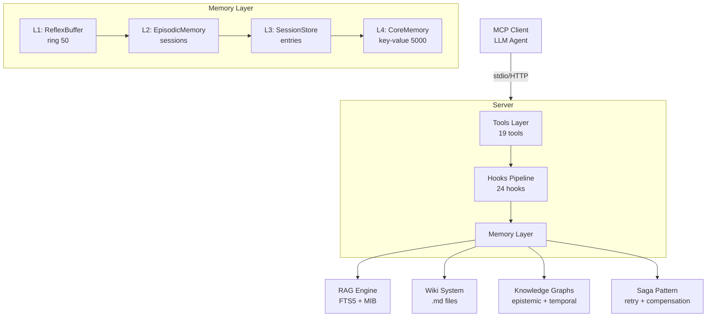
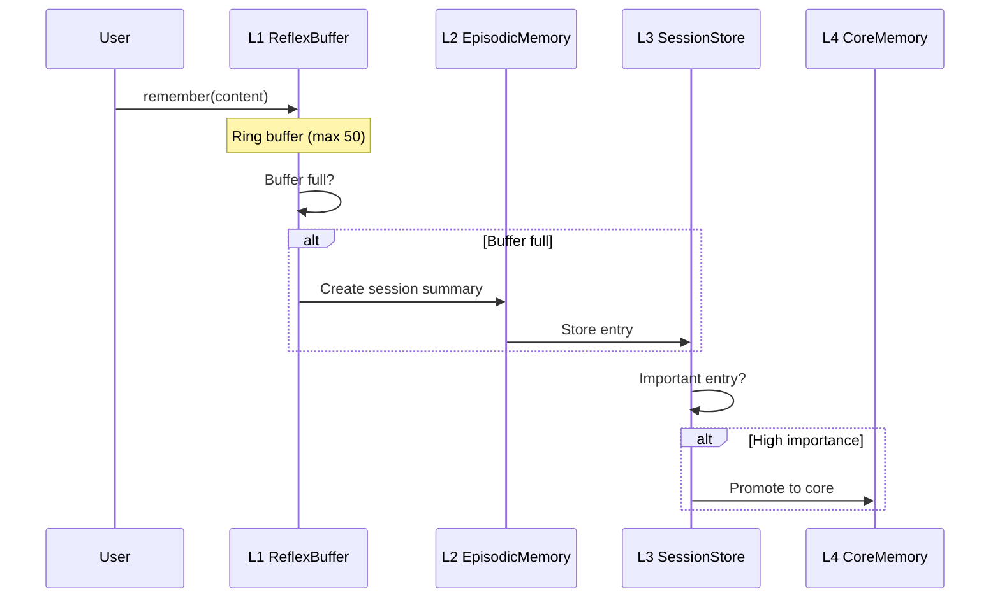
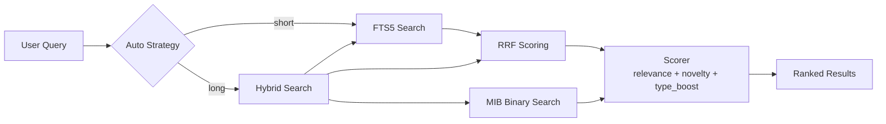
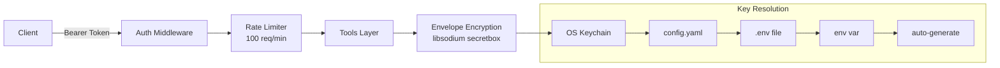
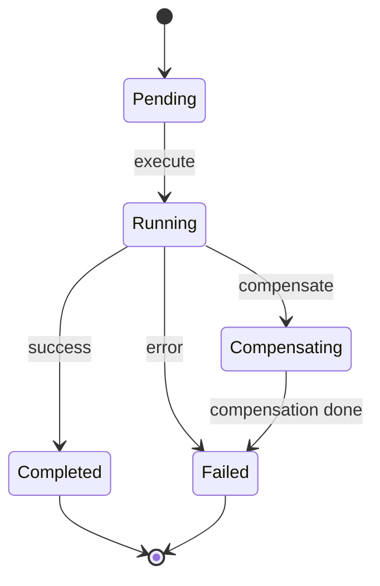
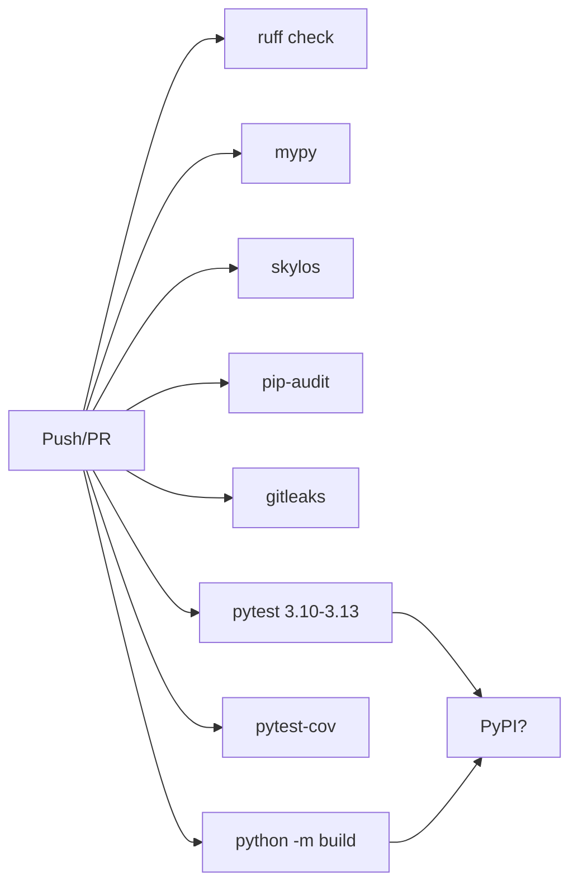

# Architecture

## System Overview

```mermaid
graph TB
    Client[MCP Client<br/>LLM Agent] -->|stdio/HTTP| Server[mcp_server<br/>FastMCP]

    subgraph Server
        Tools[Tools Layer<br/>19 tools] --> Hooks[Hooks Pipeline<br/>24 hooks]
        Hooks --> Memory[Memory Layer]
    end

    subgraph Memory Layer
        L1[L1: ReflexBuffer<br/>ring 50] --> L2[L2: EpisodicMemory<br/>sessions]
        L2 --> L3[L3: SessionStore<br/>entries]
        L3 --> L4[L4: CoreMemory<br/>key-value 5000]
    end

    Memory --> RAG[RAG Engine<br/>FTS5 + MIB]
    Memory --> Wiki[Wiki System<br/>.md files]
    Memory --> Graph[Knowledge Graphs<br/>epistemic + temporal]
    Memory --> Saga[Saga Pattern<br/>retry + compensation]
```

## Memory Consolidation Flow

```mermaid
sequenceDiagram
    participant User
    participant L1 as L1 ReflexBuffer
    participant L2 as L2 EpisodicMemory
    participant L3 as L3 SessionStore
    participant L4 as L4 CoreMemory

    User->>L1: remember(content)
    Note over L1: Ring buffer (max 50)

    L1->>L1: Buffer full?
    alt Buffer full
        L1->>L2: Create session summary
        L2->>L3: Store entry
    end

    L3->>L3: Important entry?
    alt High importance
        L3->>L4: Promote to core
    end
```

## RAG Search Pipeline

```mermaid
flowchart LR
    Query[User Query] --> Router{Auto Strategy}
    Router -->|short| FTS[FTS5 Search]
    Router -->|long| Hybrid[Hybrid Search]

    FTS --> RRF[RRF Scoring]
    Hybrid --> FTS
    Hybrid --> MIB[MIB Binary Search]
    Hybrid --> RRF

    RRF --> Scorer[Scorer<br/>relevance + novelty + type_boost]
    MIB --> Scorer

    Scorer --> Results[Ranked Results]
```

## Security Architecture

```mermaid
graph LR
    Client -->|Bearer Token| Auth[Auth Middleware]
    Auth --> RateLimit[Rate Limiter<br/>100 req/min]
    RateLimit --> Tools[Tools Layer]

    Tools --> Encrypt[Envelope Encryption<br/>libsodium secretbox]

    subgraph Key Resolution
        KR1[OS Keychain] --> KR2[config.yaml]
        KR2 --> KR3[.env file]
        KR3 --> KR4[env var]
        KR4 --> KR5[auto-generate]
    end

    Encrypt --> KR1
```

## Saga Pattern

```mermaid
stateDiagram-v2
    [*] --> Pending
    Pending --> Running: execute
    Running --> Completed: success
    Running --> Failed: error
    Running --> Compensating: compensate
    Compensating --> Failed: compensation done
    Completed --> [*]
    Failed --> [*]
```

## CI Pipeline

```mermaid
flowchart LR
    Push[Push/PR] --> Lint[ruff check]
    Push --> TypeCheck[mypy]
    Push --> Quality[skylos]
    Push --> Audit[pip-audit]
    Push --> Security[gitleaks]
    Push --> Test[pytest 3.10-3.13]
    Push --> Coverage[pytest-cov]
    Push --> Build[python -m build]

    Test --> Publish[PyPI?]
    Build --> Publish
```
